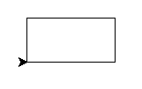
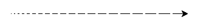
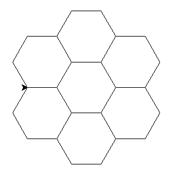

# 🐍 🐢

في هذا الدرس ، سنرسم كثيرًا باستخدام مكتبة [ColabTurtle](https://github.com/tolgaatam/ColabTurtle).

> [note]
> في الإصدارات الأقدم من المواد ، لقد استخدمنا مكتبة turtle
> وهي متوفرة في كل تثبيت لبايثون
> ولكن بدأ المزيد والمزيد من مستخدمي Mac في مواجهة مشكلات غير قابلة للإصلاح معها
> لذلك قررنا التبديل إلى ColabTurtle الذي نستخدمه أيضًا للواجبات المنزلية
> لهذا الدرس.

ابدأ تشغيل Google Colab باستخدام دفتر ملاحظات تم إنشاؤه حديثًا وقم بتثبيت وتشغيل ColabTurtle بالطريقة التالية.

أولاً ، قم بتشغيل هذا السطر في الخلية الأولى:

```console
!pip3 install ColabTurtle
```

سيؤدي هذا إلى تثبيت مكتبة ColabTurtle داخل بيئة colab الخاصة بك لهذا الدرس.
تحتاج إلى القيام بذلك مرة واحدة في كل دفتر ملاحظات colab ، حيث تريد استخدامه. تحتاج أيضًا إلى تشغيل هذه الخلية إذا قمت بإغلاق دفتر ملاحظات colab هذا وفتحه مرة أخرى.

عندما يتم ذلك ، يمكنك استيراد جميع الدالات من وحدة ColabTurtle باستخدام هذا:


```python
from ColabTurtle.Turtle import initializeTurtle, forward
```

لا تقلق ، سنناقش دوال ColabTurtle المحتملة طوال الدرس.

قبل البدء في استخدام أي أوامر السلحفاة في خلية جديدة ، تحتاج إلى تهيئتها عن طريق كتابة هذا:

```python
initializeTurtle()
```

التهيئة تعني أنه يتم إنشاء نافذة  جديدة أسفل الخلية الحالية ، ويتم تدوير صورة السلحفاة مع رأسها شمالًا ويمكنك البدء في الرسم!

جرب تحريك السلحفاة للأمام بمقدار 50 وحدة (بكسل الشاشة) عن طريق تشغيل ما يلي في خلية جديدة:


```python
forward(50)
```

يمكنك أن ترى أنه تم رسم نافذة (canvas) جديد أسفل الخلية الحالية وأن السلحفاة تترك خطًا مرسومًا خلفها بطول 50.

## الدوران (Rotation)

من أجل مسح نافذة (canvas) الرسم للرسم التالي ، تحتاج إلى استدعاء `initializeTurtle()` مرة أخرى.

يمكن للسلحفاة الدوران والزحف عبر "الورقة".

```python
from ColabTurtle.Turtle import forward, left, right, initializeTurtle
initializeTurtle()

forward(50)
left(60)
forward(50)
right(60)
forward(50)
```
## تكرار (Repetition)

هذه بالفعل طريقة قوية للغاية لرسم العديد من الصور الجميلة.

لمزيد من الخطوات ، يمكنك الرجوع بحرية إلى وصف واجهة برمجة تطبيقات ColabTurtle (ما تفعله كل وظيفة متاحة وما هي المعلمات التي تحتوي عليها كل دالة) على [https://github.com/tolgaatam/ColabTurtle#api](https://github.com/tolgaatam/ColabTurtle?tab=readme-ov-file#api).

### مربع (Square)

ارسم مربعًا.


المربع له أربعة جوانب مستقيمة متساوية وأربع زوايا قائمة 90 درجة.


```python
from ColabTurtle.Turtle import forward, left, initializeTurtle
initializeTurtle()
forward(50)
left(90)
forward(50)
left(90)
forward(50)
left(90)
forward(50)
left(90)
```


### مستطيل (Rectangle)

ارسم مستطيلًا.

حاول أن تجعل السلحفاة "تنظر" إلى الأعلى في النهاية (كما كانت في البداية).




```python
from ColabTurtle.Turtle import forward, left, initializeTurtle
initializeTurtle()
forward(100)
left(90)
forward(50)
left(90)
forward(100)
left(90)
forward(50)
left(90)

```


### ثلاثة مربعات (Three squares)

الآن ارسم ثلاثة مربعات ، كل منها يدور بزاوية 20 درجة عن المربع السابق\!



```python
from ColabTurtle.Turtle import forward, left, initializeTurtle
initializeTurtle()

forward(50)
left(90)
forward(50)
left(90)
forward(50)
left(90)
forward(50)
left(90)

left(20)

forward(50)
left(90)
forward(50)
left(90)
forward(50)
left(90)
forward(50)
left(90)

left(20)

forward(50)
left(90)
forward(50)
left(90)
forward(50)
left(90)
forward(50)
left(90)

```


### هل يمكننا تحسين ذلك؟ (Can we write it better?)

هناك الكثير من الكود! يجب أن يكون هناك طريقة لتبسيطه.

الآن سوف نتعلم الأمر `for`.

## التكرار (Repetition)

ماذا يفعل الكود التالي؟

```python
for number in range(5):
    print(number)

for greeting in 'Ahoj', 'Hello', 'Hola', 'Hei', 'Hallo':
    print(greeting + '!')
```

ماذا يفعل الأمر `for`؟


يقوم الأمر `for` بتكرار جزء من البرنامج.
إنه يكرر الأوامر التي يتم جمعها (باستعمال مسافات البداية indnent ) بعد `for`.
إنه مشابه لـ `if` - فهو ينطبق فقط على
الأوامر التي يتم جمعها أدناه.

يقوم الأمر `for x in range(n):` بتكرار الأوامر أدناه <var>n</var> مرات
يزيد تدريجياً من قيمة المتغير `x` من <var>0 إلى n-1</var>.

يقوم الأمر `for x in a, b, c, d, ...:` بتكرار الأوامر أدناه ؛
يغير المتغير `x` تدريجياً إلى <var>a</var> ، <var>b</var> ،
<var>c</var> <var>d</var> ، ...

في برمجة الكمبيوتر ، الحلقة (loop) هي تسلسل من التعليمات التي يتم تكرارها باستمرار حتى يتم الوصول إلى شرط معين.
مفهوم قوي جدًا يسمح لك بتقليل تكرار الأوامر بشكل كبير.



### إعادة كتابة المتغيرات (Overwriting variables)

ماذا يفعل البرنامج التالي؟

```python
sum = 0
# lets print how the sum is initialized before the loop starts
print("sum is", sum)
for number in 8, 45, 9, 21:
    # internal variable inside the loop is number
    print("number is", number)
    sum = sum + number
    # sum variable is holding the temporary sum of values
    print("sum is", sum)
print('loop ended, sum is', sum)
```


يقوم الأمر `sum = sum + number` بحساب قيمة
`sum + number` ، ويضيف الرقم الحالي إلى المجموع ،
ويخزن النتيجة في المتغير `sum`.
سيتم استخدام القيمة الجديدة لـ `sum` في الحلقة التالية.

في البداية يكون المجموع 0 ، وفي النهاية سيتم طباعة مجموع
أرقامنا.


### مربع (Square)

عودة إلى الرسم! هذه المرة سنستخدم الحلقات (loops).

ارسم مربعًا.

استخدم `forward` مرتين فقط ، مرة واحدة في الاستيراد
ومرة ​​واحدة كدالة.



```python
from ColabTurtle.Turtle import forward, left, initializeTurtle
initializeTurtle()

for i in range(4):
    forward(50)
    left(90)
```


### خط متقطع (Discontinuous line)

الدالتان `penup` و `pendown` من مكتبة `ColabTurtle`
تخبر السلحفاة بالتوقف / البدء في الرسم.

حاول رسم خط متقطع.



```python
from ColabTurtle.Turtle import forward, penup, pendown, initializeTurtle
initializeTurtle()
for i in range(10):
    forward(10)
    penup()
    forward(5)
    pendown()

```


الآن حاول أن تجعل الخطوط التي يتم رسمها تصبح أكبر تدريجيًا.



> [note] مساعدة
>
> ماذا يفعل الأمر `for` بالضبط؟
> هل يمكننا استخدام المتغير الذي يصنعه؟



```python
from ColabTurtle.Turtle import forward, penup, pendown, right, initializeTurtle, speed
initializeTurtle()
speed(5)
right(90) # so that the drawing still fits into the canvas
for i in range(20):
    forward(i)
    penup()
    forward(5)
    pendown()

```


>[note] تسمية متغير الحلقة (Loop variable Naming)
> استخدم دائمًا اسم متغير حلقة معنيًا ، مثل **for index_tab_browser in range(3, 18): close_tab_in_browser(index_tab_browser) ** وليس فقط i ، j ، x ، y وما إلى ذلك.
> عند استخدام أسماء ذات معنى:
> - يكون الكود أكثر قابلية للفهم من قبل الزملاء الذين يقرأون كودك ،
> - من الأسهل العثور على أخطاء في منطق الحلقة
> - عمليات البحث النصي عن اسم المتغير تعيد أجزاءًا ذات صلة من التعليمات البرمجية التي تعمل على نفس البيانات بشكل أكثر موثوقية
>
> هناك استثناء واحد - عندما تكون هذه حلقة أحادية المستوى ولا معنى للمتغير بخلاف "عدد المرات التي مررت بها خلال هذه الحلقة" ، وفي هذه الحالة يتم استخدام `i` عادةً.

### ثلاثة مربعات (Three squares)

أخيرًا ، ارسم ثلاثة مربعات ، كل منها يدور بزاوية 20 درجة.
الآن أنت تعرف كيفية كتابتها بطريقة بسيطة: كرر الكود
باستخدام `for` ، لا تكرر نفس الكود ثلاث مرات.



```python
from ColabTurtle.Turtle import forward, left, initializeTurtle
initializeTurtle()
for i in range(3):
    for j in range(4):
        forward(50)
        left(90)
    left(20)
```



## المهام الإضافية (Extra tasks)

عندما تنتهي ، حاول رسم السلالم:


عندما تنتهي أيضًا من السلالم ، حاول رسم 7 سداسيات:


